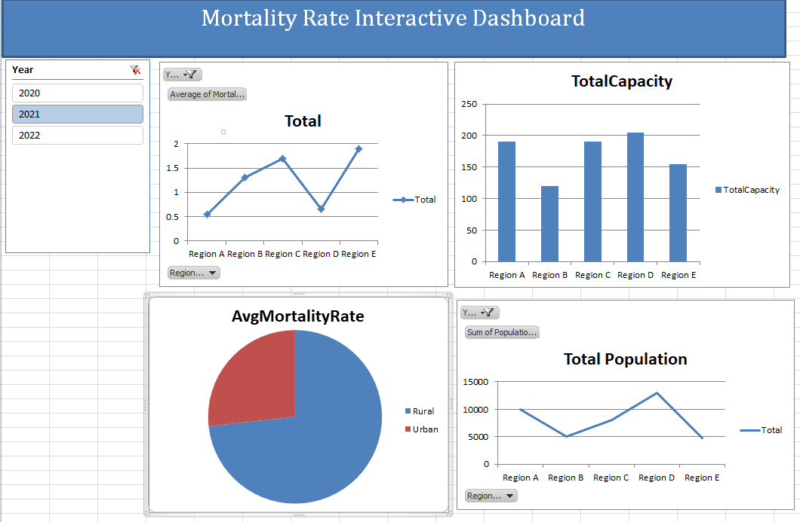

### 🔧Solving an SDG Problem with Data.

# SDG 3: Maternal Mortality Data Analysis 📊

### [](https://docs.google.com/presentation/d/1iFs9bm8bC3JX_Rr49ghvOc8DxYUAuu0m3WAhoI_A4eU/edit?usp=sharing)

This project addresses **Sustainable Development Goal 3 (Good Health and Well-being)** by analyzing maternal mortality rates and healthcare infrastructure in rural and urban regions. The goal is to identify gaps in healthcare access and provide data-driven recommendations to reduce maternal mortality.
[Click here](https://docs.google.com/presentation/d/1iFs9bm8bC3JX_Rr49ghvOc8DxYUAuu0m3WAhoI_A4eU/edit?usp=sharing) to access Pitch deck Presentation.

---

#### The Deliverables of the project are on this repository:

- [SDG problem definition document](./ProblemDefination.pdf)
- [ERD](./ERDMoratlityRate.png)
- [SQL scripts](./SQLMoratalityRate.sql)
- [Excel workbook with data analysis and dashboard](./MortalityRate.xlsx)
- [Integration documentation](#integration-documentation)
- [Pitch deck presentation link ](https://docs.google.com/presentation/d/1iFs9bm8bC3JX_Rr49ghvOc8DxYUAuu0m3WAhoI_A4eU/edit?usp=sharing)

---

The Excel work book contain 8 sheets:

- Dashboard
- MaternalMortalityRatePivot
- HealthCareCapacity
- AvgMortalityRate
- populationPivot
- population
- AvgMorarlityvsCapacity
- MaternalMortalityRate

## **Integration Documentation**

This section explains how to import data from the database into Excel and ensure consistency for analysis.

### **Step 1: Export Data from the Database**

Run the following SQL queries to retrieve the required data and export the results as CSV files:

1. **Maternal Mortality Rates by Region and Year**

   ```sql
   SELECT R.RegionName, M.Year, M.MortalityRate
   FROM MaternalMortality M
   JOIN Regions R ON M.RegionID = R.RegionID
   ORDER BY R.RegionName, M.Year;
   ```

   - Save as: `MaternalMortalityRates.csv`

2. **Healthcare Facility Capacity by Region**

   ```sql
   SELECT R.RegionName, SUM(H.Capacity) AS TotalCapacity
   FROM HealthcareFacilities H
   JOIN Regions R ON H.RegionID = R.RegionID
   GROUP BY R.RegionName;
   ```

   - Save as: `HealthcareCapacity.csv`

3. **Population Data by Region and Year**

   ```sql
   SELECT R.RegionName, P.Year, P.PopulationCount
   FROM Population P
   JOIN Regions R ON P.RegionID = R.RegionID
   ORDER BY R.RegionName, P.Year;
   ```

   - Save as: `PopulationData.csv`

4. **Maternal Mortality Rates vs. Healthcare Capacity**

   ```sql
   SELECT R.RegionName, AVG(M.MortalityRate) AS AvgMortalityRate, SUM(H.Capacity) AS TotalCapacity
   FROM MaternalMortality M
   JOIN Regions R ON M.RegionID = R.RegionID
   JOIN HealthcareFacilities H ON R.RegionID = H.RegionID
   GROUP BY R.RegionName;
   ```

   - Save as: `MortalityVsCapacity.csv`

5. **Urban vs. Rural Maternal Mortality Rates**
   ```sql
   SELECT R.UrbanRural, AVG(M.MortalityRate) AS AvgMortalityRate
   FROM MaternalMortality M
   JOIN Regions R ON M.RegionID = R.RegionID
   GROUP BY R.UrbanRural;
   ```
   - Save as: `UrbanRuralMortality.csv`

---

### **Step 2: Import Data into Excel**

1. Open Microsoft Excel.
2. Go to the **Data** tab and click on **Get Data** > **From Text/CSV**.
3. Select the CSV file you want to import and click **Import**.
4. In the preview window, ensure the data is correctly formatted (e.g., correct delimiter, no missing values).
5. Click **Load** to import the data into Excel as a table.
6. Repeat this process for all CSV files, loading each into a separate sheet in the workbook.

---

### **Step 3: Ensure Data Consistency**

1. Check for missing or inconsistent data in each table.
2. Use Excel’s **Remove Duplicates** feature to clean the data.
3. Ensure that all numeric fields (e.g., `MortalityRate`, `Capacity`, `PopulationCount`) are formatted correctly.
4. Verify that all foreign keys (e.g., `RegionID`) match across tables.

---

## **Testing Documentation**

To ensure the integration works as expected:

1. Verify data accuracy by cross-checking the data in Excel with the original database.
2. Test pivot tables and charts to ensure they update correctly when the underlying data changes.
3. Test dashboard interactivity by using slicers to filter data.
4. Validate key metrics (e.g., average mortality rate, total healthcare capacity) using Excel formulas.

---

## **How to Use This Project**

1. Clone this repository.
2. Run the SQL queries provided in the **[Integration Documentation](#integration-documentation)** to export data.
3. Import the CSV files into Excel and follow the steps above to create the dashboard.
4. Analyze the data and generate insights to address maternal mortality.
